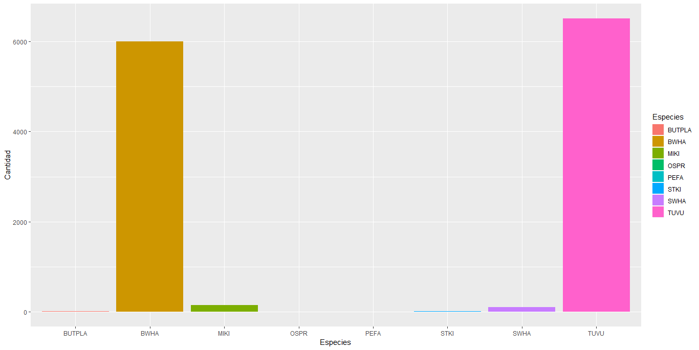

```{r setup, include=FALSE}
knitr::opts_chunk$set(echo = TRUE)
```

\
\
\
\
<center>**Figura 1** Gráfico de resultados monitoreo en Keköldi</center>
<center></center>

\
\
<p align="justify">
Como lo indica la figura 1 la especie que presento mayor número de individuos fue el *Cathartes aura* seguido por el *Buteo platypterus*, y la especie que se observo en menor cantidad de individuos fue el *Pandion halicetus*.


