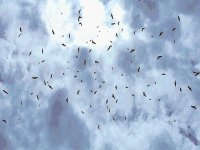

```{r setup, include=FALSE}
knitr::opts_chunk$set(echo = TRUE)
```

\
\
\
\

<center></center>
\
\
\

<p align="justify">
La migración de rapaces en el país es un evento esperado dos veces al año por los expertos, estudiantes, apasionados y aficionados de las aves, este fenómeno permite el monitoreo de poblaciones principalmente de aves rapaces que suelen migrar de día y su identificación y conteo suele estar más alcance de las personas ya que tienen tendencias para su identificación muy bien marcadas, y debido a las características geográficas de algunos sitios se suelen observar en mayor concentración, tal es el caso de Talamanca. 
</p>
\
<p align="justify">
El territorio indígena Keköldi se ubica dentro del Corredor Biológico Talamanca Caribe (CBTC), forma parte del Área de Conservación La Amistad Caribe, en la Talamanca se han registrado más de 350 especies de aves, tanto aves rapaces como migratorias y residentes el CBTC permite la migración de especies de flora y fauna que conecta con diferentes áreas protegidas (MAPCOBIO, 2017).
</p>
\
<p align="justify">
Keköldi es reconocido como la mejor región del país para observar las aves migratorias que viajan a Norte América entre los meses de marzo y abril para reproducirse, y regresan a Centro y Sur América en setiembre y octubre. Más de 2.5 millones de especies son registradas anualmente de acá la importancia de la reserva Keköldi (MAPCOBIO, 2017).
</p>

\
<p align="justify">

Keköldi cuenta  con su propio protocolo para conteo y monitoreo de aves rapaces, es una herramienta que debe utilizar cada participante en el conteo sin excepción alguna, ya que fue hecha y obtuvo su validación por medio de expertos en el campo, este protocolo permite registrar comportamiento no solo avistamientos, y ha sido una herramienta muy valiosa para posicionar a esta reserva como uno de los mejores puntos geográficos para la observación de aves en américa. 
</p>
\
\
\
<p align="justify">
Bibliografía
MAPCOBIO, 2017. Sistematizaión de la experiencia del Corredor Biológico Talamanca Caribe.