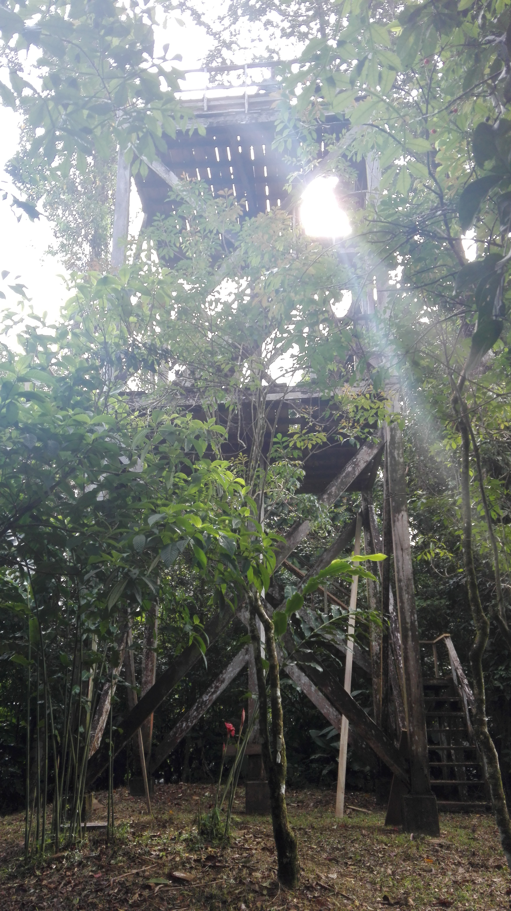
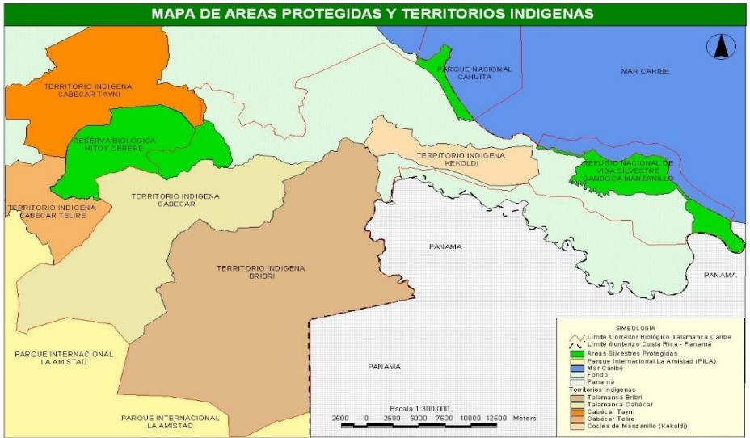

Corella-Esquivel.L

Abril, 2019

\
\

{width=150px}

\
\
\

Keköldi es una comunidad indígena ubicada en el Caribe sur del país en el cantón de Talamanca, esta dentro del corredor biológico Talamanca-Caribe el cuál abarca unas 36.000 ha. Es dirigido por la Asociación Keköldi Wak ka Köneke (Cuidadores de la Tierra de Keköldi) y está abierta al turismo. La mayoría de la población habla bribri y español a la vez. La reserva tiene un área de investigación científica y observación de aves para los turistas.

\
\
\

